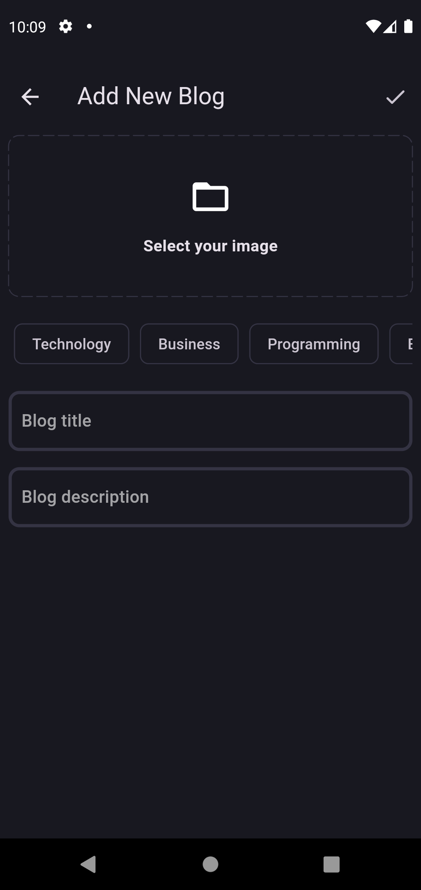

# 📃 Flutter Blog App Clean Architecture 🚀


Welcome to the Flutter Blog App! This application is built with Flutter using the Clean Architecture principles, BLoC state management, Supabase, GoRouter, and Hive for local storage.

## 💻 Technologies Used:

- Flutter: The main framework for building the app.
- Clean Architecture: Ensures a scalable and maintainable codebase.
- BLoC (Business Logic Component): Manages state efficiently.
- Supabase: Provides backend services and database management.
- GoRouter: Handles navigation in the app.
- Hive: Lightweight and fast key-value database for local storage.

## 💡 Features

- 📝 Show All Blogs: Browse through all available blog posts.
- ➕ Add Blog: Create new blog posts with ease.
- ✏️ Edit Blog: Update and modify your existing blog posts.
- ❌ Delete Blog: Remove blog posts you no longer need.
- 🔐 Authentication: Secure login and registration functionality.

## 📚 Project Structure

```plaintext
lib/
├── core/                        # Core functionality and configurations
│   └── secrets/                 # Secret keys and configurations
├── features/                    # Feature modules
│   ├── auth/                    # Authentication feature
│   │   ├── data/                # Data layer for authentication
│   │   ├── domain/              # Domain layer for authentication
│   │   └── presentation/        # Presentation layer for authentication
│   ├── blog/                    # Blog feature
│   │   ├── data/                # Data layer for blog
│   │   ├── domain/              # Domain layer for blog
│   │   └── presentation/        # Presentation layer for blog
├── app_router.dart              # Routing configurations
├── app.dart                     # Main app widget
├── init_dependencies.dart       # Dependency injection configurations
├── init_dependencies.main.dart  # Main dependency injection configurations
└── main.dart                    # Main entry point of the
```

## 📸 Screenshots

| Home Screen                            | Add Blog Screen                  | Edit Blog Screen                   |
| -------------------------------------- | -------------------------------- | ---------------------------------- |
|  |  |  |

## ✏️ Requirements

Before you begin, ensure you have the following software installed on your local machine:

- Flutter: Make sure you have Flutter installed. You can download it from the official [Flutter website](https://flutter.dev/).
- Dart: Ensure you have Dart SDK installed. It's typically included with Flutter.
- Git (optional): For version control [Download](https://git-scm.com/downloads).

## 🛠️ Installation

1. Clone the Repository:

```bash
git clone https://github.com/mohannadofficial/blog_app_clean_architecture.git
```

2. Install Dependencies:

```bash
cd blog_app_clean_architecture
flutter pub get
```

3. Set Up Supabase

- Create a Supabase Account: Sign up at [Supabase](https://supabase.io/).
- Create a New Project: Once signed in, create a new project and note down the `API URL` and `anon key`.
- Configure Authentication:

  Go to the Authentication section in your Supabase dashboard.

  Enable the Email provider for user authentication.

- Add a Storage Bucket:

  Navigate to the Storage section.

  Create a new bucket to store your blog post images or other assets with name `blog_images`.

- Create Tables:

  Profile Table: Create a table named `profiles` with fields such as `id`, `name`, `email`, `updated_at`.

  Blog Table: Create a table named `blogs` with fields such as `id`, `title`, `content`, `poster_id`, `updated_at`, `image_url`,`topics`.

- Add Keys to Secret File:

  Locate the secrets.dart file at `lib/core/secrets/secrets.dart`.

  Update the file with your Supabase URL and anon key:

  ```bash
  class Secrets {
  static const supabaseUrl = 'your-supabase-url';
  static const supabaseAnonKey = 'your-anon-key';
  }
  ```

## ⭐ Like this project?

If you find this Blog App clone with Clean Architecture project helpful, consider giving it a star on GitHub to show your support! This helps others discover the project and motivates me to continue development.

## 🙌 Contributing

We welcome contributions from the community! Feel free to fork the repository, make changes, and create pull requests.

## 🔰 License

This project is licensed under the MIT License

## 📬 Feedback

If you have any feedback, please reach out to us at info@mohnd-info.com
